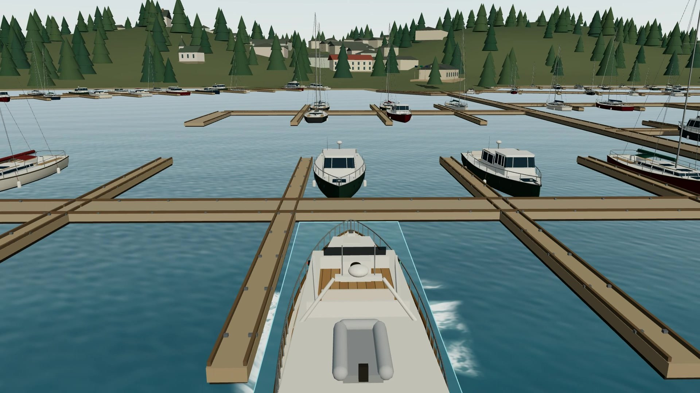
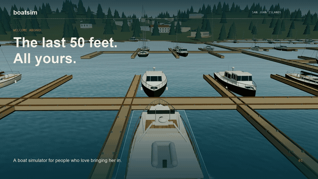
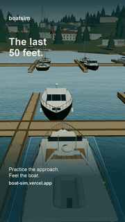

# boat-sim

### The last 50 feet. All yours.

Independent throttles. A crosswind in the fairway. Twenty-nine tons that don’t stop just because you found neutral.

**A boat simulator for people who love the part where you bring her in.** Practice twin-screw handling in the San Juan Islands, get to know a different boat, and have another go at that approach. Free to play in your browser.

[**Take the helm →**](https://boat-sim-lake.vercel.app) · [The experience](https://boat-sim-lake.vercel.app/about) · [Meet the fleet](https://boat-sim-lake.vercel.app/boats) · [Come aboard as a contributor](CONTRIBUTING.md)

[](https://boat-sim-lake.vercel.app)

## A little helm time. A lot to play with.

Click either moving preview to watch the film with sound. Both films use real simulator footage, with a little extra love for the forward camera.

| The full tour · 40 seconds | The quick dip · 15 seconds |
| :--- | :--- |
| [](https://boat-sim-lake.vercel.app/about#feature-film) | [](https://boat-sim-lake.vercel.app/about#short-film) |
| Landscape · [Download MP4](public/media/boat-sim-feature-40s.mp4) | Vertical, ready for Reels / TikTok / Shorts · [Download MP4](public/media/boat-sim-short-15s.mp4) |

Captions are built into the films so they work on mute. The [release media notes](docs/MARKETING.md) include the shot list, soundtrack details, and instructions for making the next cut.

## Things to try first

- **Split the sticks.** Put port ahead and starboard astern. Feel the turn, the prop walk, and the momentum you still have after returning to neutral. Add a little bow thrust.
- **Make that Roche Harbor approach yours.** Practice the entrance to slip I-9, try an H Dock end tie, or back out of your slip. Start in **Calm**, then let the local wind and current have a say.
- **Trade helms.** Seven profiles range from a Cranchi E26 to a 114-foot Crescent. Grand Banks teak and brass, Nordhavn steel, Chris-Craft mahogany and analog dials: the instruments belong to the boat.
- **Read the water.** Expand the plotter for depth contours, your track, a planned route, and nearby traffic. Watch speed over ground, speed through water, and depth under the keel.
- **Leave the dock behind.** Explore island approaches, drifting wakes, moored boats, passing traffic, and synthesized VHF chatter.
- **Find out what happens.** Hard contact can crush the hull, break dock sections, start flooding, or end in a sinking. There’s also gloriously unreasonable turbo. **Repair & restart** gives you a fresh boat and marina.

The scenery uses NOAA survey data and OpenStreetMap docks. The current itinerary exposes Bellingham, Sucia, Stuart, Roche Harbor, Lopez, and Cypress. Sucia’s Echo Bay stop uses the Fossil Bay scene; Lopez’s Hunter Bay stop uses Jones North Cove. Friday Harbor also has a scene in the codebase, but isn’t currently in the location picker.

This is an evolving, simplified maneuvering model, with some experimental drivetrain approximations and compressed damage effects. It is practice and play; use official charts and qualified on-water instruction for real boating.

## Your first five minutes

1. [Open the simulator](https://boat-sim-lake.vercel.app) on a desktop browser. No account or installation needed to play.
2. Choose **Calm**, keep both levers in neutral, and press **Start engines**.
3. Select **FWD** for the view from behind the boat. Drag the scene to look around.
4. Try a little thrust, let the boat respond, then bring the levers back to neutral. Neutral removes drive; it doesn’t remove momentum.
5. Restart, change the conditions, or choose a different boat. That “one more try” is the point.

| Control | What it does |
| :--- | :--- |
| `W` / `S` | Move the port lever ahead / astern |
| `I` / `K` | Move the starboard lever ahead / astern |
| `A` / `D` | Hold for bow thrust to port / starboard |
| `Space` | Return both keyboard levers to neutral |
| `H` | Show / hide instruments |
| Drag the scene | Look around |
| Scroll in **Top** view | Zoom |

Hold a throttle key to move its lever; release the key to keep the setting. Bow thrust stops when released. The keyboard button beside the sound control opens the complete shortcut guide.

**Got a USB helm?** A Thrustmaster TCA quadrant gives you two independent physical levers, engine switches, and neutral calibration through the browser’s Gamepad API. Use Chrome for quadrant support. See the [helm and hardware notes](docs/SIMULATOR_GUIDE.md#the-helm).

## Find your kind of boat

| Boat | A good reason to take her out |
| :--- | :--- |
| [Bonum Vitae · Grand Banks 52](https://boat-sim-lake.vercel.app/?boat=52-grand-banks-bonum-vitae) | The boat that started the project: heavy twin-screw docking practice |
| [Serendipity · Nordhavn 86](https://boat-sim-lake.vercel.app/?boat=86-nordhavn-serendipity) | A big displacement boat and a steel-and-white-light helm |
| [Penalty Box III · Nordhavn 55](https://boat-sim-lake.vercel.app/?boat=55-nordhavn-penalty-box-iii) | A smaller Nordhavn with its own response and profile |
| [Cranchi E26 Rider](https://boat-sim-lake.vercel.app/?boat=2026-cranchi-e26-rider) | A compact open bow, outboard styling, and a very different scale |
| [Cranchi Settantotto 78](https://boat-sim-lake.vercel.app/?boat=2026-cranchi-settantotto-78) | A modern flybridge yacht with plenty of boat to manage |
| [Chris-Craft Corsair 36](https://boat-sim-lake.vercel.app/?boat=2005-chris-craft-corsair-36) | Low foredeck, open cockpit, mahogany, and analog needles |
| [Crescent 114](https://boat-sim-lake.vercel.app/?boat=1997-crescent-custom-114) | More than a hundred feet to think about before the next turn |

Each [vessel profile](https://boat-sim-lake.vercel.app/boats) documents its specs and modeling limitations. The E26, Nordhavn 55, and triple-IPS Cranchi retain twin-lever approximations.

## Built by a boater. Better with a crew.

This started with a Grand Banks charter in the San Juans and a wish for more rehearsal before taking family and friends aboard. The open-water miles weren’t the worrying part. Backing out of a side-tie, judging leftover momentum, easing into an unfamiliar slip: those were worth practicing.

If that sounds familiar, you’re the right kind of boat nerd for this project.

**You don’t have to write code to help.** Tell us how your boat walks astern, point out a fairway that doesn’t look right, describe a useful arrival exercise, or test a throttle quadrant. An observation from someone who’s handled the real boat can be more useful than a hundred guesses.

For builders, there’s plenty to get your hands on: hull models, handling, chart data, docking exercises, instruments, accessibility, audio, and documentation. Start with a small change you can see or feel in the simulator.

[**Read the contributor guide →**](CONTRIBUTING.md) · [Report a handling issue or suggest an exercise](https://github.com/elsigh/boat-sim/issues/new) · [Browse existing issues](https://github.com/elsigh/boat-sim/issues)

And if you enjoyed your first approach, pass a film around your cruising group. We’d love more local knowledge aboard.

## Run it locally

```bash
pnpm install
pnpm dev
```

Open the URL printed by Next.js (normally [localhost:3000](http://localhost:3000)). Start the engines and take a turn. The last boat and location are remembered for the current tab; a `?boat=` link selects a specific boat.

```bash
pnpm typecheck
pnpm build
bun test src/lib/sim/boat-physics.test.ts  # when changing handling
```

The project uses a Next.js preview release. Read [AGENTS.md](AGENTS.md) and the relevant guides in `node_modules/next/dist/docs/` before changing application code.

The Electron shell can package a static build for offline use: `pnpm app:dev` or `pnpm app:build`. See [desktop distribution notes](docs/MAC_APP_STORE.md) and [release instructions](docs/releases.md).

## Under the deck

Next.js App Router · React Three Fiber + drei · Rapier · TypeScript · WebAudio

| Area | Start here |
| :--- | :--- |
| Handling and damage | [`src/lib/sim/`](src/lib/sim/) |
| Boats, specs, and helm themes | [`src/lib/boats/`](src/lib/boats/) |
| Berths, exercises, and local conditions | [`src/lib/marinas/`](src/lib/marinas/) |
| NOAA / OSM chart pipeline | [`scripts/charts/`](scripts/charts/) |
| Instruments and plotter | [`src/components/sim/helm/`](src/components/sim/helm/) |
| Films and release media | [`scripts/marketing/`](scripts/marketing/) |

[Detailed simulator and build notes](docs/SIMULATOR_GUIDE.md) · [Route import and storage](docs/ROUTES.md) · [Vessel valuation model](docs/vessel-values.md)

Charts and docks draw on NOAA and OpenStreetMap data; source details and OSM’s ODbL attribution are in the [chart notes](docs/SIMULATOR_GUIDE.md#charts). Other audio attribution lives in [public/audio/ATTRIBUTION.md](public/audio/ATTRIBUTION.md). No affiliation with the featured boat or hardware manufacturers is implied.

Built with considerable help from coding agents, who also needed reminding which way the bow swings when the port engine goes ahead.

**See you in the fairway.**
