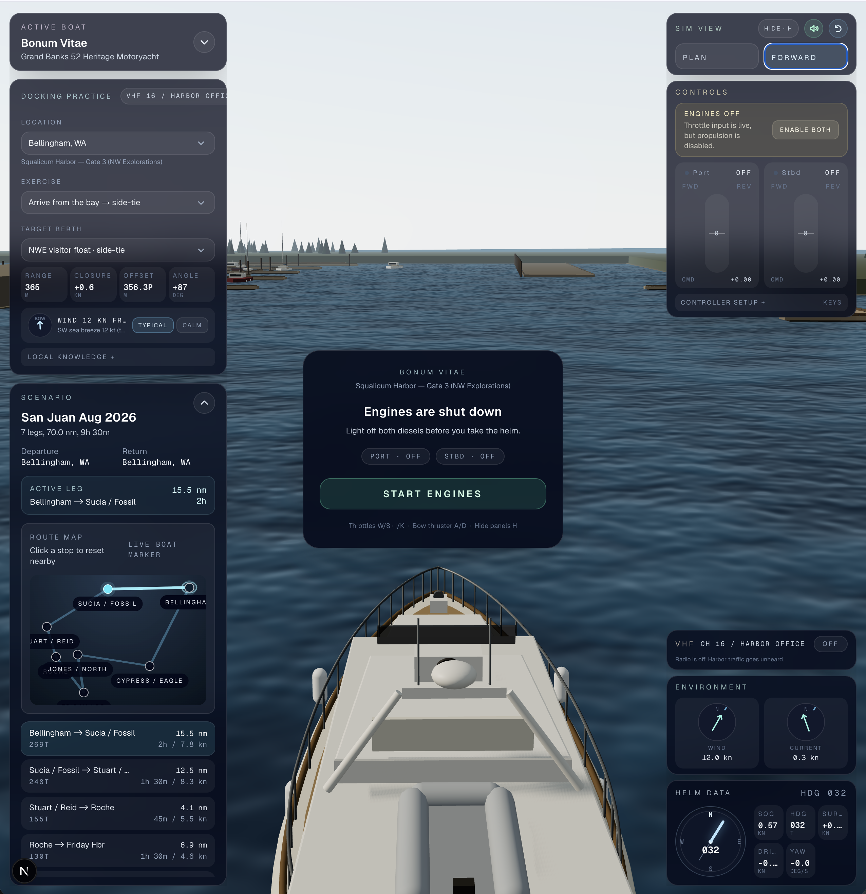
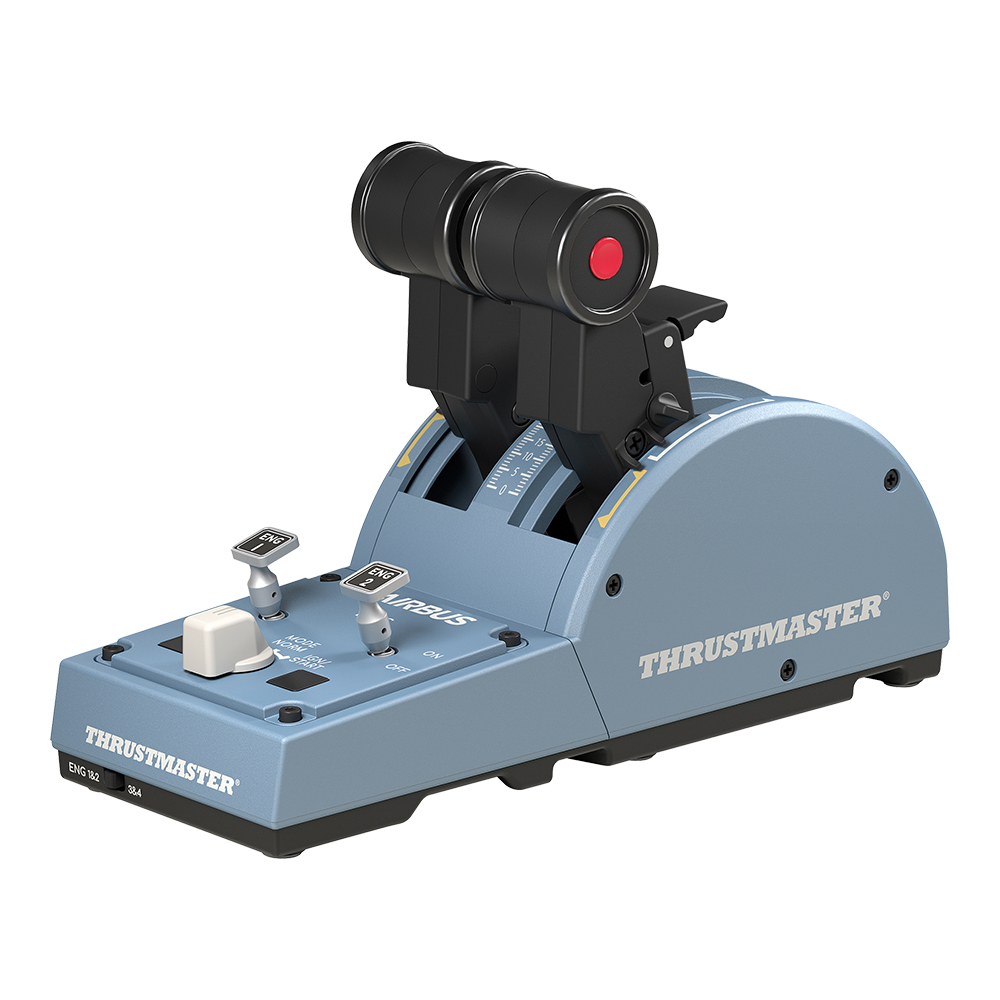

# boat-sim

Twin-screw docking practice in real San Juan Islands marinas.



## Why this exists

At the end of August 2026 I'm supposed to captain *Bonum Vitae* — a Grand
Banks 52 Heritage Motoryacht, about 58,000 pounds of her — through the San
Juan Islands with family and friends aboard. I trained on similar boats about
five years ago, but five years is enough time for confidence to turn back
into theory, especially when the theory involves easing 29 tons into a narrow
slip while wind and current negotiate a different arrangement.

So I did what any reasonably anxious programmer might do: I built a
simulator.

This was never meant to be a general boating game. It's rehearsal. The cruise
runs Bellingham → Sucia → Stuart → Roche Harbor → Friday Harbor → Jones →
Cypress → Bellingham, and the moments that occupied my mind were never the
open-water legs — they were the slow minutes at either end: backing out of a
side-tie, entering an unfamiliar basin, judging leftover momentum, making
three small corrections before one big one becomes necessary.

A twin-screw motoryacht doesn't steer like a car at those speeds. Port engine
ahead swings the bow to starboard. A handed propeller in reverse walks the
stern sideways. The bow thruster shoves the bow, not the boat. And when the
levers come back to neutral, 58,000 pounds does not come back to neutral with
them. That inertia — not which lever, but *how early* and *how long* — is the
thing this simulator exists to practice.

## The helm



I almost bought a real Glendinning twin-lever marine control head before
discovering it speaks CAN bus, costs as much as a good dinghy, and would have
turned "practice docking" into "learn embedded electronics by modifying
safety-critical marine hardware."

Instead: a Thrustmaster TCA throttle quadrant. It was designed for an Airbus,
but it has the two things that matter — two independent physical levers, and
a browser can read it through the Gamepad API. The sim handles the
airplane-to-boat mismatch: swap-levers for reversed axes, idle-detent
calibration so lever travel above the detent means ahead and below means
astern, and the quadrant's switches double as engine masters and ignition.

No hardware? Keyboard works: `W`/`S` port throttle, `I`/`K` starboard,
`A`/`D` bow thruster. (Use Chrome for the quadrant — Safari never exposes
it.)

## What's in the sim

- **Physics that punish impatience** — per-engine thrust with prop walk,
  bow thruster at the bow, wind and current per marina, quadratic hull drag,
  and honest inertia. Telemetry shows SOG, heading, drift, and yaw rate.
- **Seven real anchorages** from the actual cruise plan, with layouts traced
  from harbor maps and OSM: Squalicum, Sucia (Fossil Bay), Reid Harbor,
  Roche Harbor, Friday Harbor, Jones Island, and Eagle Harbor. Each has
  arrival/departure exercises against real berths.
- **Consequences** — hit something hard enough and the hull takes damage:
  scuff, minor, major, severe, judged by closing speed at the point of
  contact. Gelcoat cracks stay on the hull; splintered timber stays on the
  dock. Restarting the exercise repairs everything, which is cheaper than
  the real arrangement.
- **A lived-in marina** — finger slips are two-thirds full of moored boats,
  the occasional small craft runs the fairway in or out, and the VHF panel
  murmurs synthesized harbor chatter if you leave it monitoring.
- **Guidance that respects land** — the wayline is a live shortest-water-path
  (A* over a per-marina navigation grid) from wherever you are to the berth,
  replanned as you drift. It goes around docks, pilings, and moored boats,
  never through them.
- **Turbo mode** — press `T` at full throttle. It is not seamanship.

## Running it

```bash
npm install
npm run dev
```

Open http://localhost:3000, pick a marina and an exercise, `START ENGINES`,
and try to dock without appearing in the incident log. `H` hides the panels.

The Electron desktop build (`npm run app:dev` / `npm run app:build`) wraps the
static export for offline use aboard.

## Stack

Next.js (App Router) · React Three Fiber + drei · Rapier physics · WebAudio
for engine and radio sound · TypeScript. Marina layouts are plain data in
`src/lib/marinas/`; the boat's force model lives in
`src/lib/sim/boat-physics.ts`; collision damage in
`src/lib/sim/collision-damage.ts`; water pathfinding in
`src/lib/sim/water-nav.ts`.

Built with heavy assistance from coding agents, which turned out to be a
fitting crew: they also needed to be told, repeatedly, which way the bow
swings when the port engine goes ahead.
